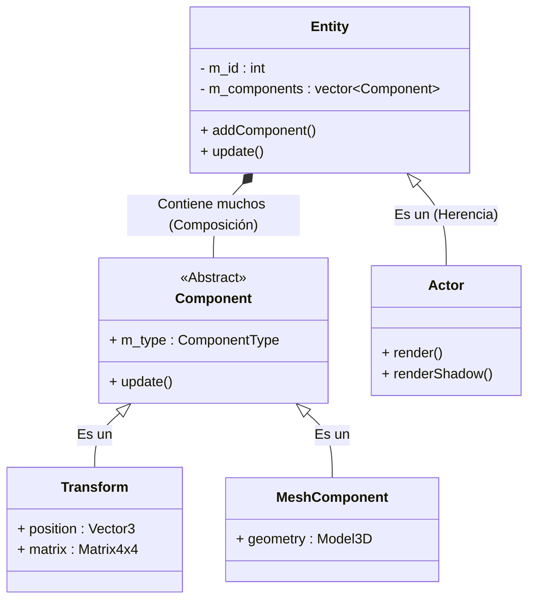

-----

# 🛠️ MonacoEngine2 — Motor Gráfico ECS (DirectX 11)

## 📋 Resumen

**MonacoEngine2** es una evolución completa del motor original, transformado en una arquitectura modular basada en componentes (**ECS - Entity Component System**) y desarrollado en C++ con **Direct3D 11**.

A diferencia de su predecesor monolítico, esta versión implementa un diseño de software profesional, gestión de memoria personalizada, carga de modelos complejos (FBX) y herramientas de depuración en tiempo real.

## 🚀 Características Principales

### 🏗 Arquitectura y Diseño

  * **Sistema ECS (Entity-Component-System):** Desacoplamiento total entre lógica y datos mediante `Entities`, `Actors` y `Components`.
  * **Gestión de Memoria Propia:** Implementación de Smart Pointers personalizados (`TSharedPointer`, `TUniquePtr`) con conteo de referencias para evitar fugas de memoria.
  * **Math Library Custom:** Motor matemático propio (`EngineUtilities`) sin dependencias externas para álgebra lineal (Matrices 4x4, Quaterniones, Vectores).

### 🎨 Gráficos y Renderizado

  * **Carga de Modelos FBX:** Integración del **Autodesk FBX SDK** para cargar mallas complejas y animaciones, superando las primitivas hard-coded.
  * **Iluminación y Sombras:** Implementación de **Shadow Mapping** y modelos de iluminación básicos.
  * **Soporte de Texturas:** Carga y gestión de texturas (DDS, PNG, JPG) y Samplers.
  * **Pipeline Programable:** Gestión encapsulada de Vertex y Pixel Shaders HLSL.

### 🛠 Herramientas

  * **ImGui Integrado:** Interfaz gráfica inmediata (GUI) para manipular variables y depurar la escena en tiempo de ejecución.
  * **Logging System:** Sistema de macros (`MESSAGE`, `ERROR`) para trazabilidad en la Output Window de Visual Studio.

-----

## 🏛 Arquitectura del Sistema (ECS)

El motor estructura los objetos del juego siguiendo una jerarquía de composición en lugar de herencia profunda.

### 🧠 Explicación de la Arquitectura

1.  **Entity (El Contenedor):** La clase base de cualquier objeto en la escena. Su función principal es poseer una lista de componentes.
2.  **Actor (La Representación):** Una especialización de `Entity` que tiene capacidad de ser renderizada en el mundo 3D y proyectar sombras.
3.  **Component (La Lógica/Datos):** Piezas modulares que dan funcionalidad.
      * **`Transform`**: Almacena la posición, rotación y escala (Matriz de Mundo).
      * **`MeshComponent`**: Contiene la geometría cargada (usando FBX o primitivas).

-----

## 📷 Pipeline Gráfico Implementado

El flujo de renderizado ha sido abstraído en clases C++ que envuelven la API de DirectX 11:

1.  **Inicialización (`BaseApp::init`):**

      * Creación de ventana Win32 y SwapChain (4x MSAA).
      * Compilación de Shaders (`.fx`) e Input Layouts.
      * Inicialización de sistemas de ImGui y FBX Manager.

2.  **Update Loop (`BaseApp::run`):**

      * Cálculo de `DeltaTime`.
      * Recorrido de todos los **Actores** para llamar a sus métodos `update()`.
      * Recálculo de matrices de mundo en los componentes `Transform`.

3.  **Render Loop (`BaseApp::render`):**

      * **Shadow Pass:** Se renderiza la escena desde la perspectiva de la luz para generar el mapa de sombras (`DepthStencilView`).
      * **Main Pass:** Se renderiza la escena final usando el mapa de sombras y las texturas.
      * **UI Pass:** Se dibuja la interfaz de ImGui sobre la escena 3D.
      * **Present:** Se intercambian los buffers (`SwapChain::present`).

-----

## 📂 Estructura de Archivos

| Directorio | Contenido |
|---|---|
| `include/ECS` | Clases del sistema de entidades (`Actor`, `Component`, `Entity`). |
| `include/EngineUtilities` | Librerías propias de Matemáticas y Memoria (`TSharedPtr`, `Matrix4x4`). |
| `include/fbx` | Headers del SDK de Autodesk FBX. |
| `include/ImGui` | Headers de la interfaz gráfica de depuración. |
| `source/` | Implementación (`.cpp`) de la lógica del motor. |
| `Resources/` | Assets (Modelos FBX, Texturas DDS y Shaders FX). |

-----

## 🎯 Objetivos Cumplidos

| Objetivo | Estado | Implementación |
|---|---|---|
| **Arquitectura ECS** | ✅ | Clases `Entity` y `Component` funcionales. |
| **Carga de Modelos** | ✅ | Integración completa con FBX SDK. |
| **Math Library** | ✅ | Vectores, Matrices y Quaterniones propios. |
| **Memoria Segura** | ✅ | Sistema de `TSharedPointer` implementado. |
| **Debug UI** | ✅ | ImGui renderizando sobre DirectX 11. |
| **Sombras** | ✅ | Renderizado de Shadow Maps. |
